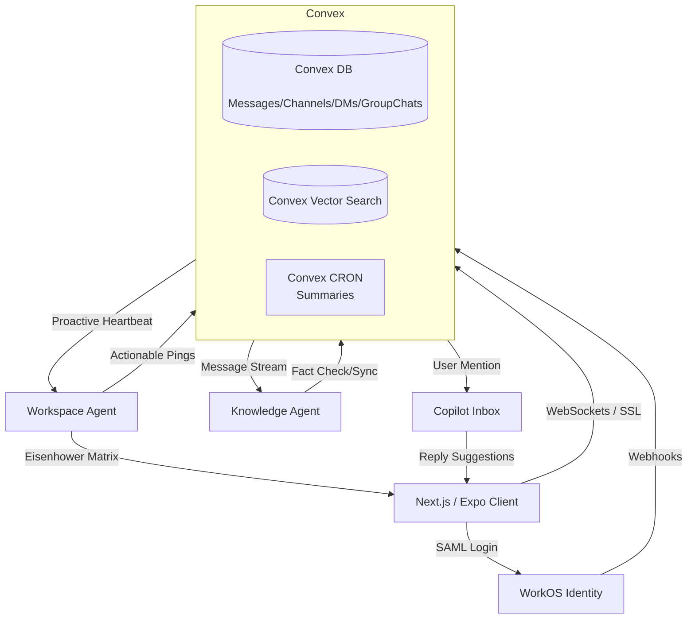

# PING System Architecture

## 1. Overview
PING is an open-core, AI-native team communication platform. This architecture is explicitly designed for a highly constrained 48-hour MVP build, optimizing for real-time reactivity, AI integration, and instant enterprise readiness.

### Core Stack
*   **Frontend/Mobile:** Next.js (Web) / Expo (React Native) + Tailwind CSS
*   **Backend & Reactive State:** Convex (Serverless Backend as a Service)
*   **Identity & Enterprise Auth:** WorkOS
*   **AI orchestration & Knowledge Graph:** Graphiti + Vercel AI SDK 

---

## 2. High-Level Architecture Diagram

---

## 3. Component Details

### 3.1 Frontend (Next.js / Expo)
*   **UI Paradigm:** Implements the "Copilot Inbox" and actionable UI cards instead of a traditional chat layout.
*   **State Management:** Inherently managed by `convex/react` bindings. No Redux/Zustand required for messaging state; Convex handles optimistic updates and real-time syncing automatically.

### 3.2 Backend (Convex)
*   **Real-time Sync:** Completely replaces the need for a separate Redis pub/sub layer and WebSocket server.
*   **Vector Storage:** Built-in vector capabilities index messages the moment they are written to the database.
*   **Background Jobs:** Convex actions handle asynchronous tasks like hitting the OpenAI API to generate the "Copilot Inbox" summaries without blocking the main execution thread.

### 3.3 Identity (WorkOS)
*   **User Provisioning:** Handled immediately via SCIM / Directory Sync.
*   **SSO:** Replaces complex Auth0 or NextAuth setups to ensure immediate SOC2 compliance and enterprise readiness for mid-market customers.

### 3.4 Knowledge Engine (Temporal Knowledge Graph)
*   **Temporal Graph-RAG:** Constructs a continuous, temporal semantic web of the workspace. It understands how your project structures, PRs, and team members evolve over time.
*   **Insane "Memory Magic" Onboarding:** Auto-ingests GitHub, Jira, and Linear history instantly upon connection, surfacing hidden decisions immediately to provide value even for 1-person teams.
*   **Data Ownership & Custom Models:** Our open-source foundation allows CTOs to own their graph data entirely and train custom LLMs directly on company knowledge for maximum precision.

### 3.5 Proactive Agents & Workflow Acceleration
*   **Workspace Agent (Core):** The primary engine that ranks all incoming messages and reminds users based on the **Eisenhower Matrix** (Urgent/Important). It triggers on a system heartbeat and proactive message analysis to push work forward in relevant channels.
*   **Copilot Inbox:** Transformed from a simple summary tool into an interactive assistant that flags follow-ups and generates high-context reply suggestions.
*   **Knowledge Agent:** A proactive listener that fact-checks real-time discussions (e.g., "Actually, we tried that migration in 2023") and syncs context between teams (e.g., "Frontend is shipping a fix on Monday").
*   **Proactive vs. Reactive:** All AI work is proactive by default. Reactive work (direct queries) is only triggered via an "Add Agent" button within DMs, Group Chats, or the dedicated User Agent Chat.

## 4. The 48-Hour Execution Flow

1.  **Hours 0-12 (Foundation):** Next.js setup, WorkOS integration, and Convex schema definition (`users`, `channels`, `dms`, `group_chats`, `messages`).
2.  **Hours 12-24 (The Proactive Shift):** Build the Workspace Agent heartbeat. Implement the Eisenhower Matrix ranking logic for incoming messages.
3.  **Hours 24-40 (The Brain):** Connect Graphiti. Pipe every inbound chat message into Graphiti. Create proactive Knowledge Agent hooks for fact-checking and cross-team syncing.
4.  **Hours 40-48 (The Magic Bot):** Build the interactive Copilot Inbox for reply suggestions and follow-up flagging.
